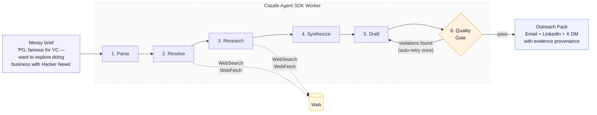
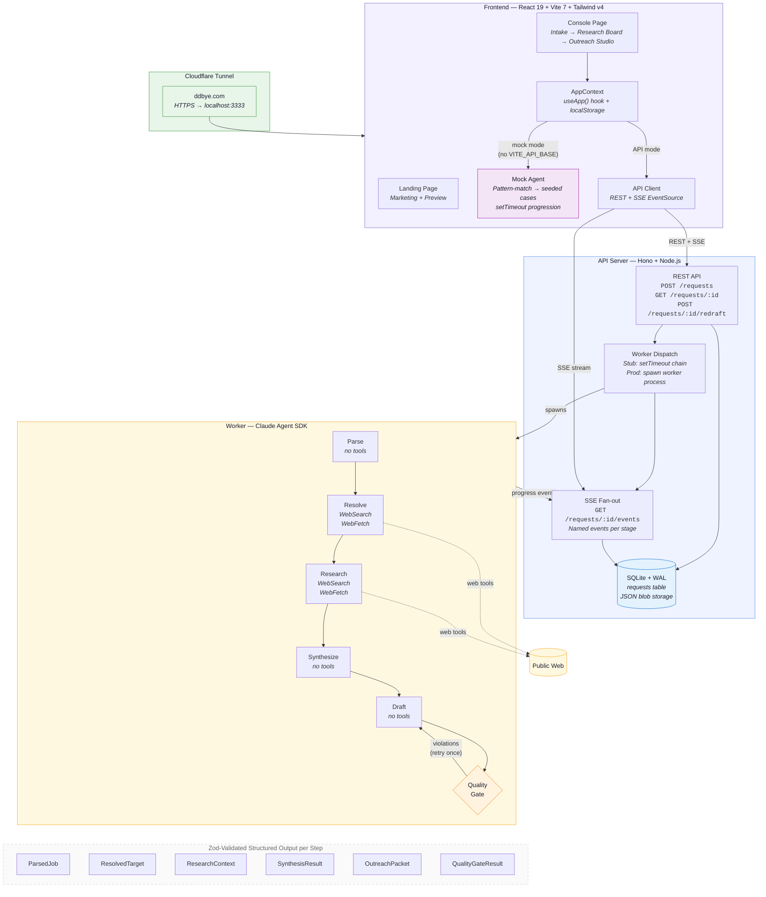

# DDBye

**Due diligence first. Outreach second.**

[ddbye.com](https://ddbye.com)

DDBye turns a messy target brief into defensible, evidence-backed outreach in under 60 seconds. No more "I've been following your work" cold emails. Every claim traces to a source. Every angle is grounded in real research.



## The Problem

Cold outreach is broken. Founders and salespeople either:
- **Spray and pray** — generic templates that get ignored
- **Spend hours** manually researching each target before writing a single email

Both approaches fail. The first is lazy. The second doesn't scale.

## How DDBye Solves It

DDBye enforces a simple rule: **never write copy before resolving the target.** The system runs a 6-step agent pipeline that does real due diligence before drafting anything.

### The Pipeline

| Step | What it does | Tools |
|------|-------------|-------|
| **Parse** | Extracts structured intent from your messy brief | - |
| **Resolve** | Identifies the actual person, org, and pitchable surface | WebSearch, WebFetch |
| **Research** | Investigates focus areas (background, product gaps, objections) | WebSearch, WebFetch |
| **Synthesize** | Compresses research into one defensible outreach angle | - |
| **Draft** | Writes email, LinkedIn DM, and X DM — all grounded in evidence | - |
| **Quality Gate** | Audits for overclaiming, fake familiarity, and unsupported assertions | - |

If the quality gate catches violations, it loops back to the draft step with the violation list as corrections. One automatic retry — if the re-draft still has issues, it ships with warnings attached.

### What Makes It Different

- **Evidence provenance** — Every claim is labeled `Public web` (with URL), `User brief`, or `Inference`. Nothing is made up.
- **Quality gate** — Checks for 5 prohibited patterns: overclaiming, fake familiarity, target insults, unsupported assertions, evidence-copy mismatch.
- **Three channels, one angle** — Email (with subject lines), LinkedIn DM, and X DM all share the same research and angle but adapt to channel norms.
- **Tone and goal awareness** — Respects whether you're selling, fundraising, recruiting, seeking advice, or proposing a partnership.

## Demo

Try the two seeded examples in the console:

**PG / Hacker News** — Pitching a hosted search product to Paul Graham. The agent discovers HN's Algolia search limitations, identifies user complaints about single-word queries, and crafts an angle that respects Graham's minimalist philosophy.

**a16z / Andreessen** — Fundraising outreach to a16z. The agent researches their investment thesis, portfolio patterns, and finds the right entry point.

## Quick Start

```bash
npm install
npm run dev
```

Open [http://localhost:3000](http://localhost:3000). The frontend runs standalone with simulated agent data — no API key needed for the demo.

## Tech Stack

- **Frontend**: React 19, TypeScript, Vite 7, Tailwind CSS v4
- **Agent Worker**: Claude Agent SDK with WebSearch + WebFetch server tools
- **Server**: Hono + SQLite + SSE streaming
- **Quality**: Vitest, Playwright, ESLint, TypeScript strict mode

## Architecture

```
src/           React frontend — Landing page + Console (intake, research board, outreach studio)
server/        Hono API server — REST + SSE for real-time progress
worker/        Claude Agent SDK pipeline — 6-step agent with Zod-validated structured outputs
```

The worker uses the Claude Agent SDK's `query()` function with JSON Schema output format. Each step gets its own Zod schema, system prompt, and tool allowlist. Web tools are only enabled for the resolve and research steps — all other steps run with tools disabled.

## Technical Architecture



### Data Flow

**Mock mode** (demo, no server): Brief → pattern-match to seeded case → `setTimeout` chain (1.1s → 2.3s → 3.6s → 5.0s) → progressive stage updates → localStorage.

**API mode** (production): Brief → `POST /requests` → server dispatches worker → worker runs 6-step Claude Agent SDK pipeline → SSE streams named events (`request.parsing`, `request.resolved`, ...) → frontend hydrates on `request.ready`.

**Evidence provenance** is enforced end-to-end: every claim carries a `sourceType` label (`Public web` with URL, `User brief`, or `Inference`) from Zod schemas through to the rendered outreach copy.

### Type System

Three parallel type definitions kept in sync manually:

| Layer | File | `RequestStatus` |
|-------|------|-----------------|
| Frontend | `src/types.ts` | 3 states: `running · ready · failed` |
| Server | `server/src/types.ts` | 8 states: `queued · parsing · resolving · researching · synthesizing · drafting · ready · failed` |
| Worker | `worker/src/types.ts` | Pipeline-internal types + `ProgressEvent` callbacks |

## Built With

Built at the 2026 Portland Hackathon using [Claude Code](https://claude.ai/code) as the primary development tool.

---

*See [README.dev.md](README.dev.md) for developer setup, testing instructions, and project structure details.*
